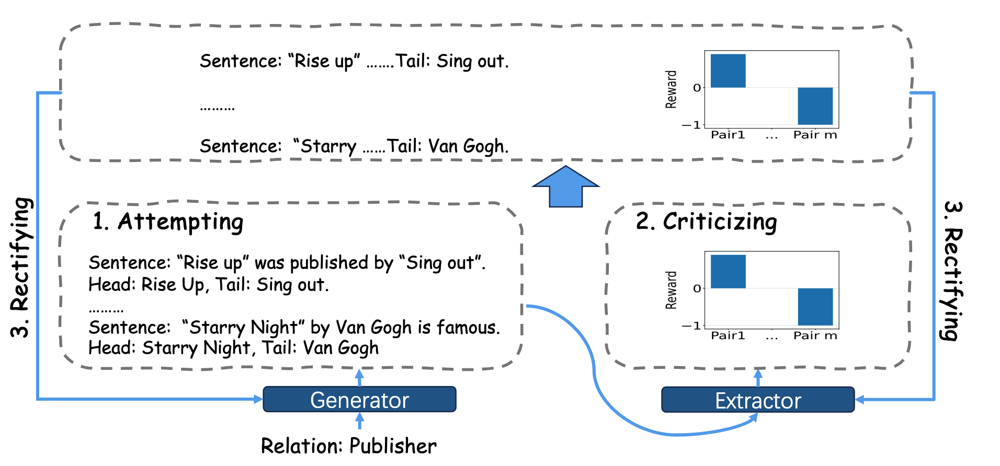

# A Two-Agent Game for Zero-shot Relation Triplet Extraction
This repository contains code and data for the paper: 
[A Two-Agent Game for Zero-shot Relation Triplet Extraction](https://aclanthology.org/2024.findings-acl.446/)(Xu et al. ACL Findings 2024). Below is the framework of the paper.



## Environment Setup
For RelationPrompt + TAG:
`pip install -r RelationPrompt/requirements.txt`

For TableSequence +TAG:`pip install -r TableSequence/requirements.txt`

## Run TAG
Our main code include `./RelationPrompt` and `./TableSequence`

To run RelationPrompt + TAG: 

```
cd RelationPrompt 
 python wrapper_rl.py main_dual --path_train outputs/data/splits/zero_rte/fewrel/unseen_5_seed_0/train.jsonl --path_dev outputs/data/splits/zero_rte/fewrel/unseen_5_seed_0/dev.jsonl --path_test outputs/data/splits/zero_rte/fewrel/unseen_5_seed_0/test.jsonl --save_dir output/wrapper/fewrel_rl_all_rsFalse_nbrel_500/unseen_5_seed_0 --with_train True --num_iter 5 --score_only_ext True --by_rel False --rl_version all --rescale_train False   --num_gen_per_label 500
 ```

To run TableSequence + TAG: 

```
cd TableSequence 
python wrapper.py main_dual --path_train zero_rte/fewrel/unseen_5_seed_0/train.jsonl --path_dev zero_rte/fewrel/unseen_5_seed_0/dev.jsonl --path_test zero_rte/fewrel/unseen_5_seed_0/test.jsonl --save_dir outputs/wrapper/fewrel_rl_all_rsFalse_nbrel_withTrainFalse_synthetic_large/unseen_5_seed_0/ --num_iter 5 --data_name fewrel --split unseen_5_seed_0 --type synthetic --model_size large --with_train False --by_rel False --rl_version all --rescale_train False --score_only_ext True --num_gen_per_label 500  
```

## Citation
```
@inproceedings{xu-etal-2024-two,
    title = "A Two-Agent Game for Zero-shot Relation Triplet Extraction",
    author = "Xu, Ting  and
      Yang, Haiqin  and
      Zhao, Fei  and
      Wu, Zhen  and
      Dai, Xinyu",
    month = aug,
    year = "2024",
    url = "https://aclanthology.org/2024.findings-acl.446",
}
```
